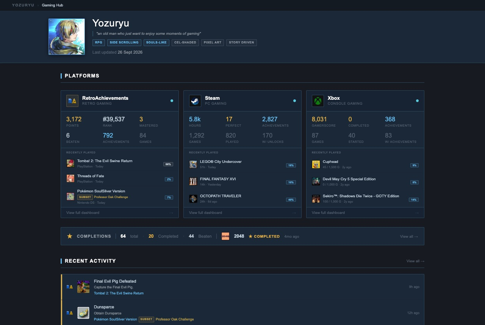
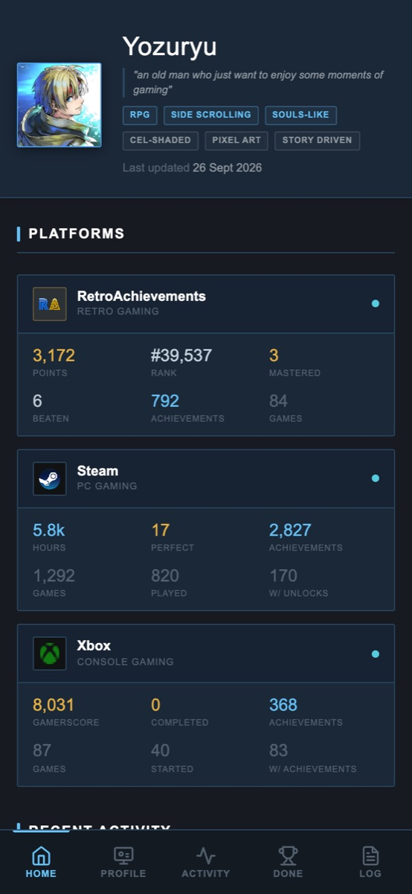
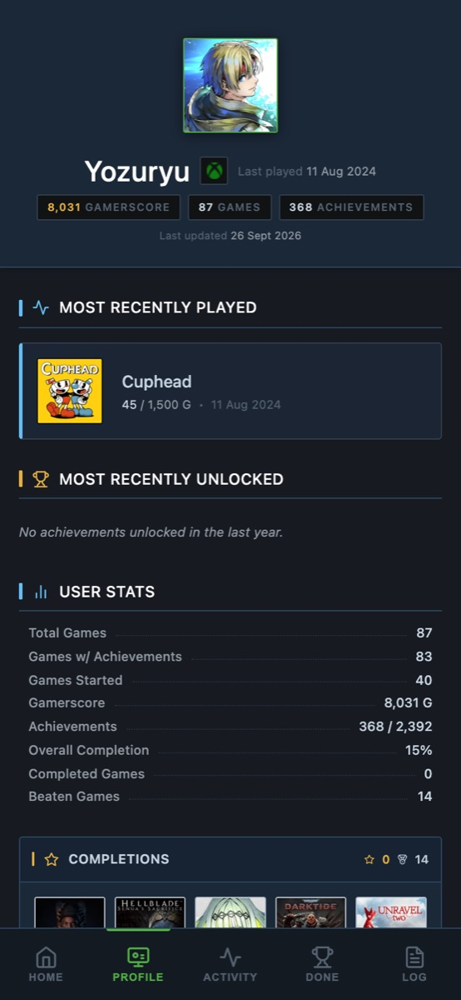
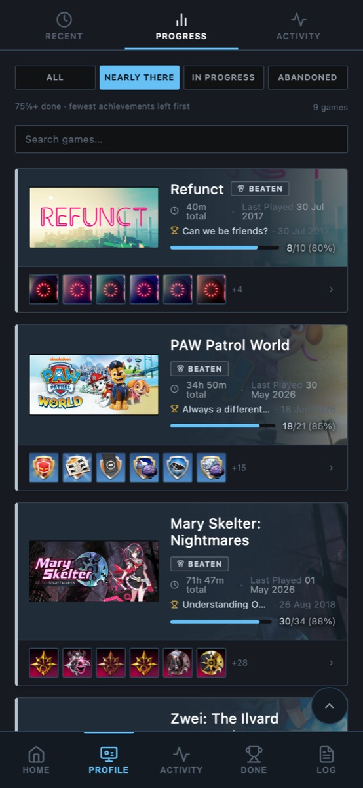
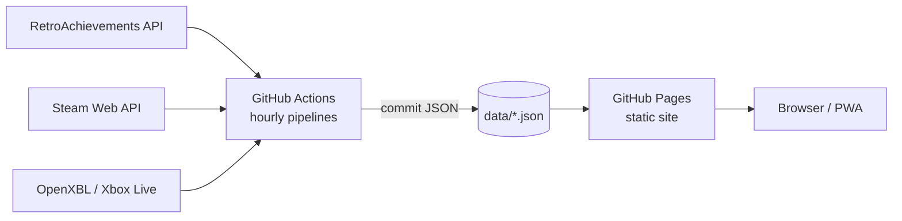

# Gaming Hub

A personal achievement dashboard that brings **RetroAchievements**, **Steam** and **Xbox** together in one place: profiles, completion progress, a year of unlock activity, and every game I've mastered or beaten.

**Live site → [yozuryu.github.io/gaming-hub](https://yozuryu.github.io/gaming-hub/)**

[](https://github.com/yozuryu/gaming-hub/actions/workflows/fetch-ra-data.yml)
[](https://github.com/yozuryu/gaming-hub/actions/workflows/fetch-steam-data.yml)
[](https://github.com/yozuryu/gaming-hub/actions/workflows/fetch-xbox-data.yml)



<p align="center">
  
  
  
</p>

## Features

- **Hub** — one card per platform with headline stats and recently played games, a combined recent-activity feed, and a completions summary.
- **Platform profiles** — RetroAchievements, Steam and Xbox pages with recent games, completion progress, an activity heatmap and a per-game achievement viewer (rarity, unlock dates, gamerscore).
- **Progress views** — *Nearly there* (75%+ done, fewest achievements left first), *In progress* (played in the last 30 days) and *Abandoned* (quiet for 30+ days).
- **Completions** — every mastered, perfected, completed and beaten game across all three platforms, grouped by year and month.
- **Beaten tracking** — RetroAchievements reports "beaten" itself; for Steam and Xbox a game counts as beaten when its hand-picked ending achievement (a *win condition*) is unlocked.
- **Activity** — a year of unlocks from all platforms on one timeline and heatmap, with streaks.
- **Installable PWA** — works offline, has a mobile bottom navigation bar, and picks up new versions on its own.

Status colors are the same everywhere: gold for completed, silver for beaten, blue for in progress.

## How it works

There is no backend and no build step. Scheduled GitHub Actions fetch the data, commit it to the repo as JSON, and GitHub Pages serves the static site that reads it.



| Platform | Pipeline | Schedule (UTC) | Data |
|---|---|---|---|
| RetroAchievements | `scripts/ra-pipeline.js` | hourly at :00, full refresh at 00:00 | `data/ra/` |
| Steam | `scripts/steam-pipeline.js` | hourly at :10, unlocked-games refresh at 00:10 | `data/steam/` |
| Xbox | `scripts/xbox-pipeline.js` | hourly at :27, full refresh at 00:27 | `data/xbox/` |

The pipelines only fetch what changed where they can, retry throttled or failed requests, and stop before writing anything if the data would be incomplete.

## Tech stack

- **Frontend:** React 18, Tailwind CSS and Lucide icons loaded from CDNs, with JSX compiled in the browser by Babel. No bundler, no npm install for the site.
- **Pipelines:** Node.js 20 scripts using [`@retroachievements/api`](https://github.com/RetroAchievements/api-js), the [Steam Web API](https://steamcommunity.com/dev) and [OpenXBL](https://xbl.io/).
- **Hosting & automation:** GitHub Pages and GitHub Actions.

## Project structure

```
index.html            Hub page
profile/ra|steam|xbox Platform profile pages
activity/             Combined activity timeline and heatmap
completions/          All completions across platforms
changelog/            Changelog viewer (reads changelog.md)
admin/                Local admin panel (not published)
assets/               Icons, avatar, shared mobile navigation
data/                 JSON written by the pipelines (+ hand-edited config and win conditions)
scripts/              Data pipelines and the local admin server
sw.js, manifest.json  Service worker and PWA manifest
```

## Running locally

Requires Node.js 20.

```bash
npm install
```

Create a `.env` file in the repo root:

```bash
RA_USERNAME=your-ra-username
RA_API_KEY=your-ra-web-api-key       # retroachievements.org → Settings → Keys
STEAM_USER_ID=your-17-digit-steam-id
STEAM_API_KEY=your-steam-web-api-key # steamcommunity.com/dev/apikey
XBOX_API_KEY=your-openxbl-api-key    # xbl.io dashboard
```

Fetch data:

```bash
npm run ra-fetch          # incremental   (ra-fetch:full, ra-fetch:watchlist)
npm run steam-fetch       # incremental   (steam-fetch:unlocked, steam-fetch:full)
npm run xbox-fetch        # incremental   (xbox-fetch:full)
# add :debug to a pipeline (e.g. npm run xbox-fetch:debug) to inspect API responses
```

Serve the site:

```bash
npm start                 # serves the repo root with `npx serve`
```

The service worker is scoped to `/gaming-hub/`, the GitHub Pages path. To test it locally too, serve the parent folder instead (for example `npx serve ..`) and open `/gaming-hub/`.

### Admin panel

```bash
npm run admin             # http://localhost:3131
```

A local-only panel for editing the hub config, RetroAchievements guides and series, and Steam/Xbox win conditions, running pipelines, and reviewing data changes before committing them.

## Deployment

1. Fork or clone the repo and enable **GitHub Pages** (deploy from the `main` branch).
2. Add repository secrets: `RA_USERNAME`, `RA_API_KEY`, `STEAM_USER_ID`, `STEAM_API_KEY`, `XBOX_API_KEY`.
3. Set your username, motto and visible platforms in `data/hub/config.json`.
4. Run each **Fetch … Data** workflow once from the Actions tab; after that they run on schedule.

## Notes

- Project history lives in [`changelog.md`](changelog.md), which is also shown on the site's Changelog page.
- Planned work is tracked in [`backlog/`](backlog/README.md).
- This is a personal project; the data is mine, but the code works for anyone with their own API keys.
